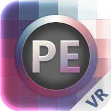
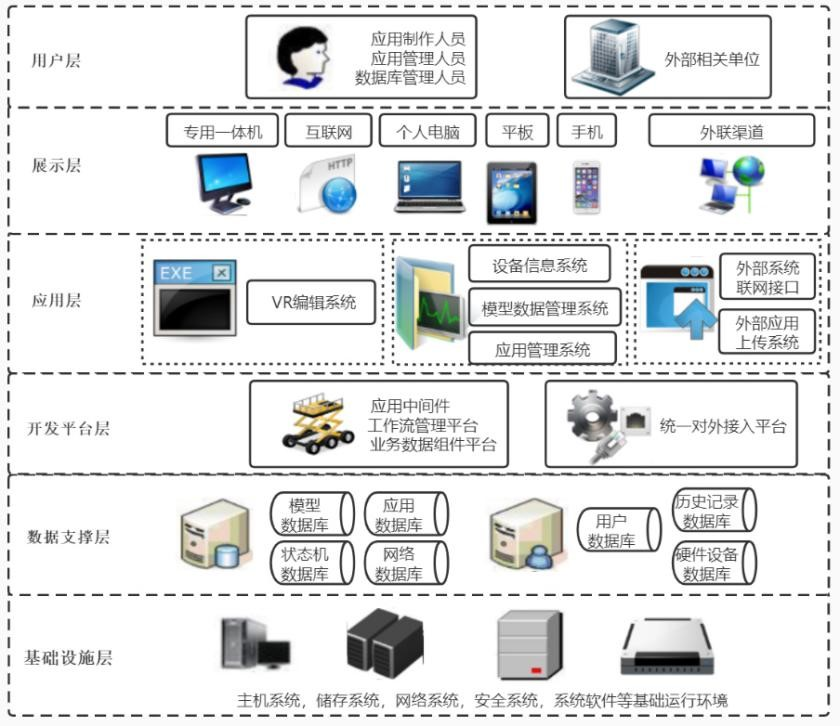
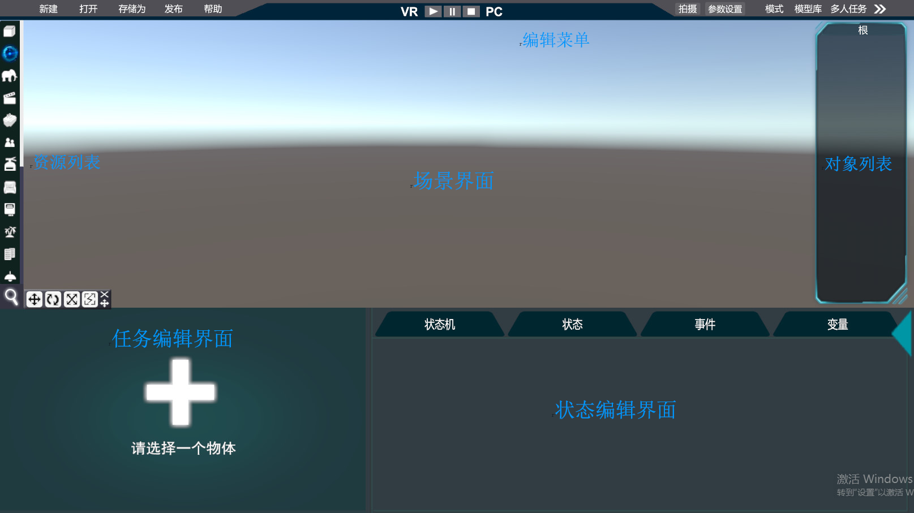
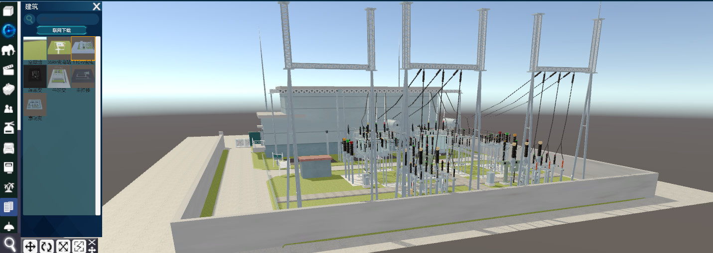
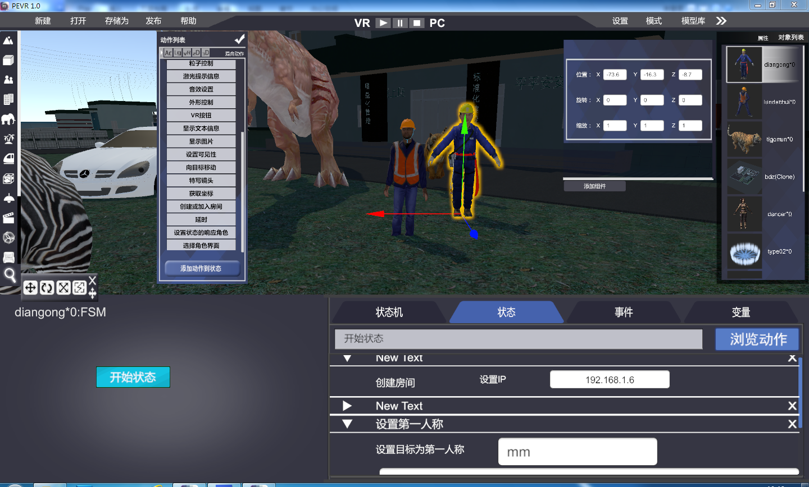
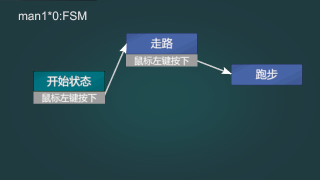

---

# **U-Creation PEVR Engine**

## A powerful tool for rapidly creating VR courseware.

### **VR Promotes a New Ecology of Education and Training**

- Simulates practical training environments.
- Saves time and costs.
- Enhances learning effectiveness and efficiency.
- More secure and reliable.
- ariseisbug

### **How to Create VR Courseware**

Traditionally, teachers would convey their courseware requirements to software companies, which would then develop the VR courseware. However, since the developers at software companies are not frontline teachers, it's challenging for them to accurately grasp the true needs of the teaching content. This often leads to a mismatch between the developed VR courseware and its effective use in teaching. Additionally, it's inconvenient for teachers to modify the VR courseware content as needed, especially when teaching content and methods are not static and need to be adjusted in real-time according to the students' abilities.

### **PEVR Engine for Creating VR Courseware**

- No need to understand software development.
- No need to understand 3D modeling.
- No need to spend too much time.

### **Features of U-Creation PEVR Engine**

The U-Creation PEVR Engine is a rapid development tool designed specifically for VR applications in education, training, and simulation. Typically, developing virtual simulation software requires developers to have basic software programming knowledge and to use specific programming languages, which demands a high skill level from developers. In contrast, the U-Creation PEVR Engine allows developers to create professional-level virtual reality applications without knowing any programming languages, simply by dragging and dropping with a "what you see is what you get" approach, greatly reducing the barriers and costs associated with VR simulation software development.

The framework of U-Creation PEVR products is designed based on the concept of task flow. For example, states such as open, close, walk, idle, attack, and defend are composed of one or more behaviors, and events drive the transition between different states. Therefore, U-Creation PEVR products mainly include modules such as scene editing management, behavior management, event management, and task management. 

**Zero Threshold**
- Fully visual "drag and drop" design, developers can start developing VR simulation software after just a few days of simple training without knowing any programming language.

**Rapid Development**
- Compared to traditional programming development, the development efficiency can be increased by tens of times.

**Openness**
- Customers can modify at any time and run directly without compilation.

### **System Architecture**

Demonstration diagram

### **Instructions for Use**

[PEVR操作手册](PEVR-README/pevr使用手册.doc)

### Contact information

mailbox：unitech20021118@gmail.com
